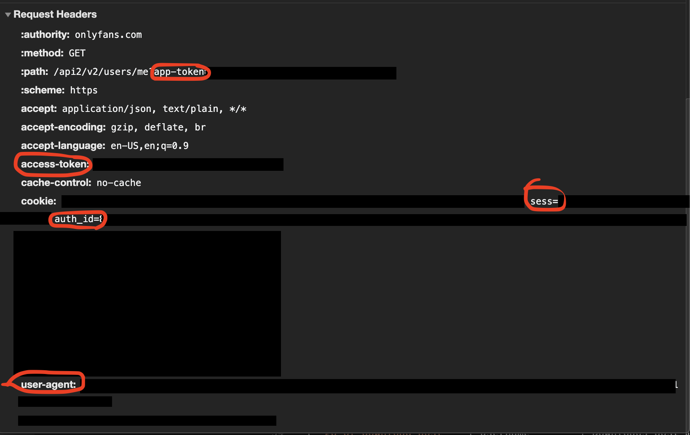

# Go-OF

a golang cli to interact with the onlyfans api

## Local Install
Assuming you have go installed..

`go get github.com/januairi/go-of`

or

`git clone https://github.com/januairi/go-of.git` then cd into the directory and run `go install`

go-of use a config file in the users $HOME directory called ~/.go-of
it can be a yaml or json file

it requires the following key-value pairs
```
token: app-token
session: access-token or sess
user_agent: user-agent
auth_id: auth-id
save_dir: abs/path/to/where/content/should/be/saved
```

these values can be found by logging into onlyfans and inspecting the network api calls that have query params with the value ?app-token=some-value


## Commands
The commands use common verbs and phrases to be called, all start with a prefix of `go-of`

example: `go-of download photo onlyfansuser1234`

| Command      | Args | Output    |
| :---        |    :----:   |          ---: |
| `go-of download photo`       | username       | Downloads photos to directory provided in config   |
| `go-of download video`   | username        | Downloads videos to directory provided in config      |
| `go-of download post`   | username        | Downloads post media to directory provided in config      |
| `go-of download archived post`   | username        | Downloads post media to directory provided in config      |
| `go-of get user`   | username        | Spits out user info in json format    |


## FAQ

No you can't bypass paywalls with this cli.

No you can't download content you haven't paid for.

No this isn't an onlyfans hack.

No information from this program is shared.
