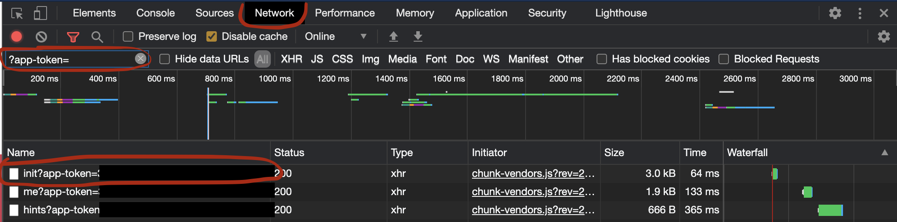

# Go-OF

A go CLI to scrape and archive content from onlyfans.

## Local Install
Assuming you have go installed..

`go get github.com/januairi/go-of`

or

`git clone https://github.com/januairi/go-of.git` then cd into the directory and run `go install`

go-of makes use of a config file in the users $HOME directory that can be YAML or JSON format. The file can be called ~/.go-of.json or ~/.go-of.yaml

You can also set environment variables or pass the key-value pairs on the command line.

These are templates that can be used for your config file:

YAML:
```
token: app-token
session: access-token or sess
user_agent: user-agent
auth_id: auth-id
save_dir: abs/path/to/where/content/should/be/saved
```

JSON:
```
{
   "token": "app-token",
   "session": "access-token or sess",
   "user_agent": "user-agent",
   "auth_id": "auth-id",
   "save_dir": "abs/path/to/where/content/should/be/saved"
}
```

These values can be found by logging into onlyfans and inspecting the network api calls that have query params with the value ?app-token=some-value.

In chrome you can right click on the web page, click inspect, and navigate to the network tab.

You can filter the api calls with `?app-token=`.



Once you find an appropriate api call, clicking on the headers should look like the following:


## Commands
The commands use common verbs and phrases to be called, all start with a prefix of `go-of`

example: `go-of download photo onlyfansuser1234`

| Command      | Args | Output    |
| :---        |    :----:   |          ---: |
| `go-of download photo`       | username       | Downloads photos to directory provided in config   |
| `go-of download video`   | username        | Downloads videos to directory provided in config      |
| `go-of download post`   | username        | Downloads post media to directory provided in config      |
| `go-of download archived post`   | username        | Downloads post media to directory provided in config      |
| `go-of download message`   | username        | Downloads message media to directory provided in config      |
| `go-of download highlight`   | username        | Downloads story highlights media to directory provided in config      |
| `go-of get user`   | username        | Spits out user info in json format    |


## FAQ

No you can't bypass paywalls with this cli.

No you can't download content you haven't paid for.

No this isn't an onlyfans hack.

No information used by this program is shared.
